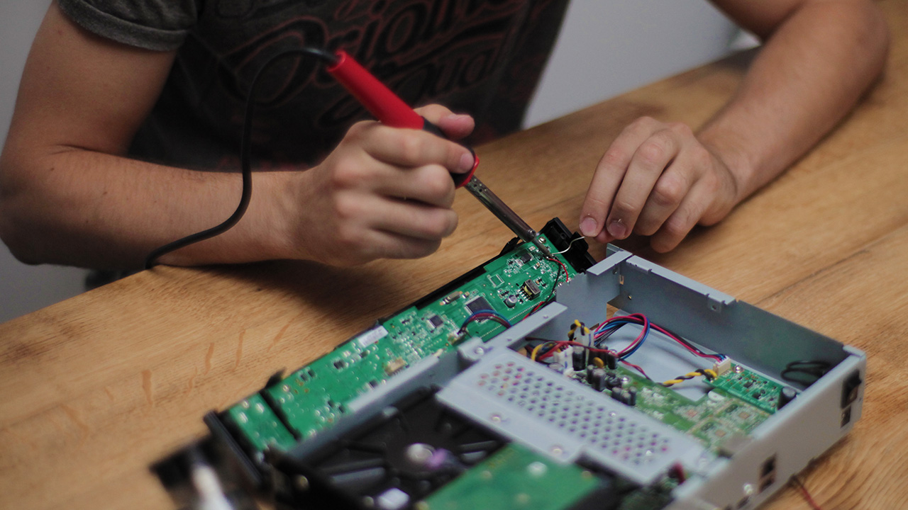
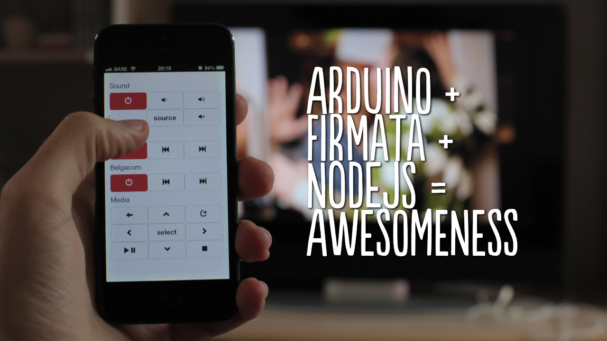

Just got back from the ever brilliant Reasons to be Creative conference in Brighton. I participated in this year's elevator pitch (20 back to back 3-minute presentations!), had a ton of stress (and fun) presenting on the main stage!

I wanted to share some of the work I've been doing with javascript and hardware.

One of my side projects the last couple of months was building a better remote for my television and setop box. I was frustrated each time I wanted to watch tv, I had to use 3 different remotes to turn on the tv, turn on my surround system and control the digital tv setop box. So I grabbed an Arduino some IR leds and started soldering where IR control wasn't possible.

I hooked up the Arduino to a raspberry pi, running a nodejs server. Next up I built a little javascript app to trigger Arduino commands. Et voila: sending different commands in one easy web interface

My tv was a little too big to bring with me on stage, and I wanted to do something interactive with the entire audience. So I built some ledstrips into two lego cars, to recreate the KITT (Knightrider) led effect. The audience was randomly divided into two groups (car A or car B). People had to shake their phones as hard as they could during 30 seconds. The total energy of the group was mapped to the speed of the led effect, and in the end one of the two cars "won".

I was quite nervous if it was going to work, because I hadn't been able to test this setup with hundreds of people at once. But luckely the WiFi gods were benevolent, and everything worked as it should :-)

It was great to hear all the lovely feedback afterwards, and to hear that my talk was picked to give a full presentation next year!