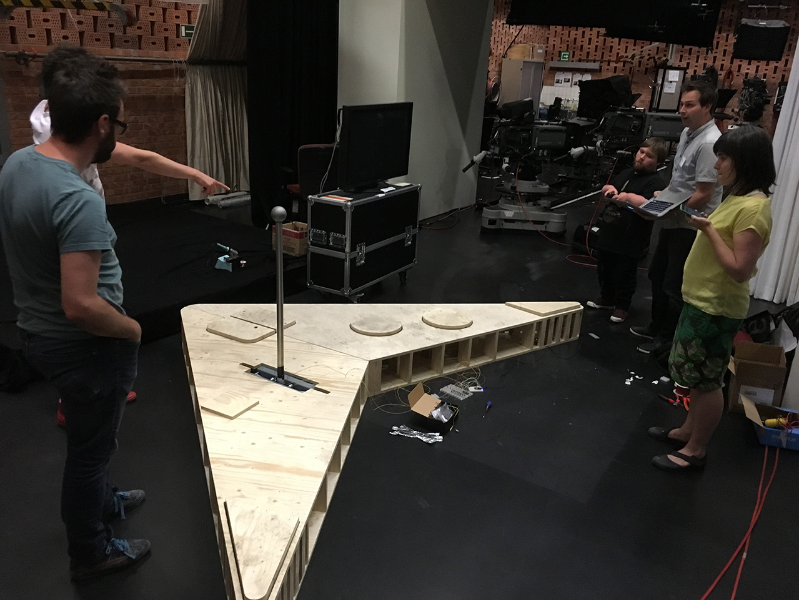
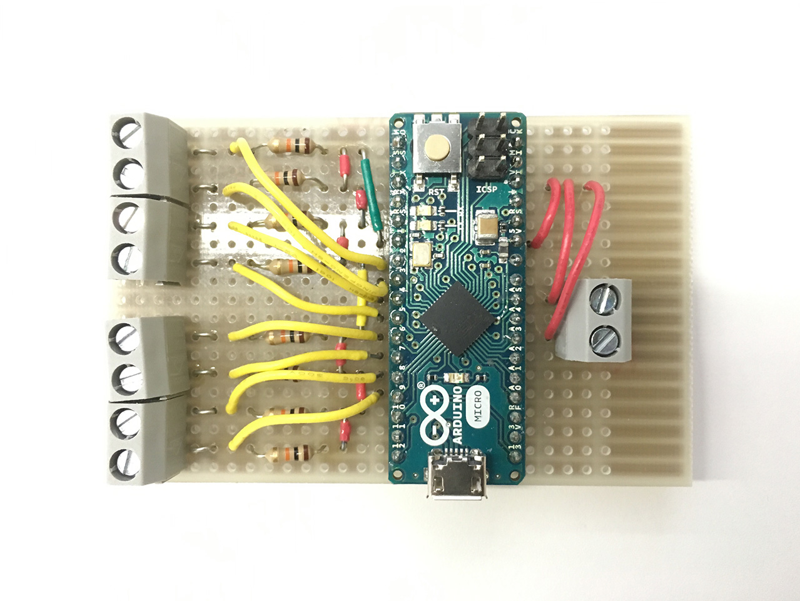
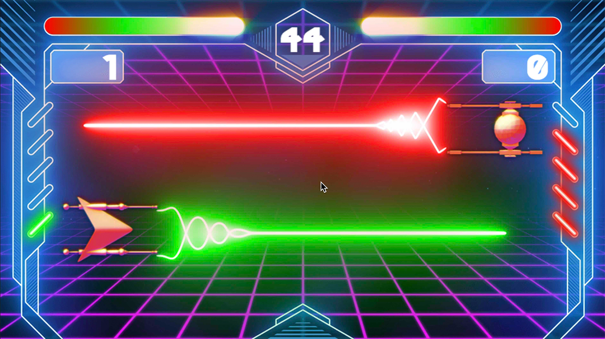

I had the pleasure to work on another fun project for [Ketnet](https://ketnet.be). They're launching a tv show around gaming, with famous comedian [William Boeva](https://www.williamboeva.be/) as it's host. During the show, they wanted kids to play a simple game against Boeva. The kids would play using a giant controller, and have to collaborate, while Boeva is playing against them using a regular game controller.

The giant controller was built by the decor people at [Ketnet](https://ketnet.be).

To keep things as simple as possible, I went for an Arduino micro, which is a compact Arduino board, capable of emulating a keyboard. This way I don't have to deal with setting up complicated communication flows using sockets or native code: I can simply listen for keyboard events in the frontend code!

I build the game itself using [PhaserJS](https://phaser.io), which has [proven itself worthy of running on live television in a previous project](/2015/09/04/kinect-game-for-live-television/).

The graphics were made in-house at Ketnet by Sam Pauwels.

It was fun seeing it all come together again on the big screen! Oh, and as it was built using web technologies, [you can also play it online](https://www.ketnet.be/spelen/2beat-boeva)!