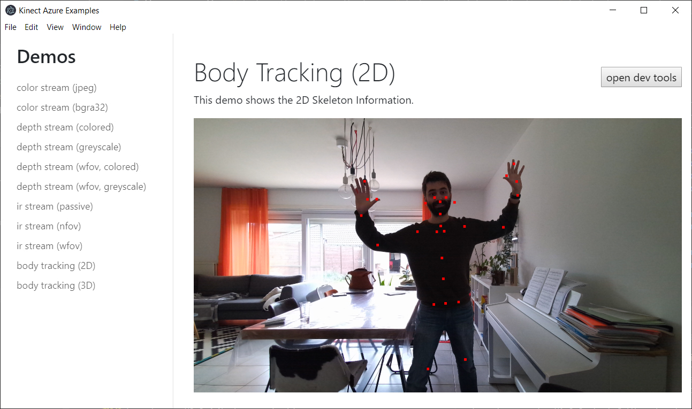

A couple of weeks ago, my Kinect for Azure arrived (thank you [Lisa Jamhoury](http://lisajamhoury.com/) to shipping me one!). And: oh my god, it is so tiny, compared to the Kinect 2!

The size does seem to come with a prize: you need a beefy computer + GPU in order to get decent skeletron tracking performance. The reason behind this is the skeleton tracking is now happing through CUDA accelerated Machine Learning models. Not quite sure about this approach, as the load on your system is quite high, and the gains in tracking seem only marginal compared to the Kinect v1.

I quickly went ahead and started putting together a nodejs native extension to access the data from the Kinect. In my Kinect2 extension, I was using the [native abstractions for nodejs package a.k.a. nan](https://github.com/nodejs/nan). But since then, there's a [new way of building native nodejs extensions, through N-API](https://nodejs.org/api/addons.html#addons_n_api). The benefit of this is ABI stability: no more need to recompile for different nodejs or electron versions! So I wanted to go for that approach for my new library.

You can [find my azure kinect for nodejs/electron library on Github](https://github.com/wouterverweirder/kinect-azure). Right now it has the following features:

- get rgb camera feed
- get depth feed
- get ir feed
- transform between color and depth feed
- point cloud (greyscale and colored)
- get skeleton joints (2d and 3d)

Stay tuned for further updates, such as user masking and accessing other sensor data (accelerometer, temperature, ...)