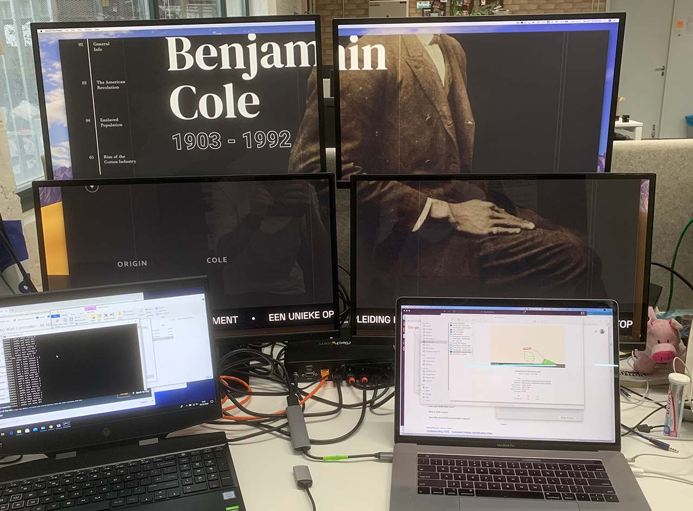
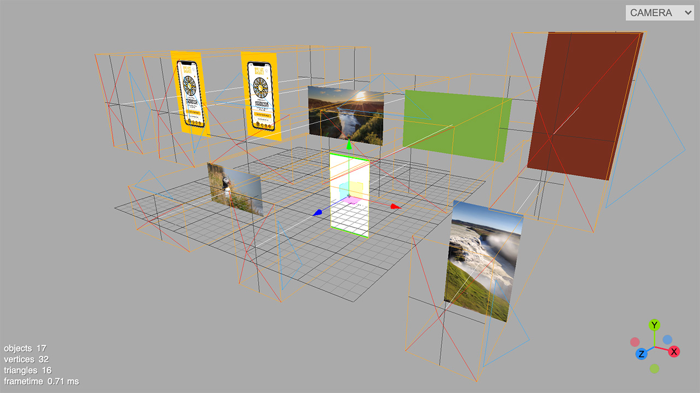
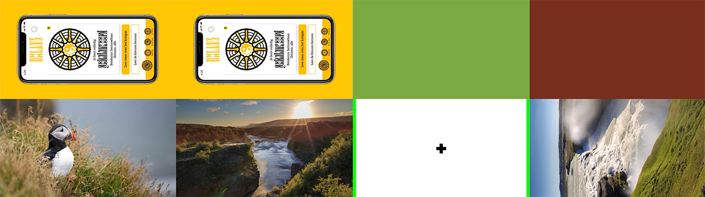

To present work of this year's Devine graduates, we wanted to do something more. After a brainstorming session, we ended up with presenting their work on an 8-screen setup. We want to use these 8 screens in a dynamic way: sometimes they'll form one big viewport on an image or video, in other scenarios each screen will contain an image or text on it's own. We want to be able to animate content between the screens.

Resolution on each of the screens should be as high as possible, and we wanted a "random", flexible screen layout. Next up, it should have an interactive element: using a big button or other interactions, visitors should be able to browse through content.

After doing some technical research, I ended up with a couple of possible approaches:

- Using multiple output ports, with [nvidia mosaic](https://www.nvidia.com/en-us/design-visualization/solutions/nvidia-mosaic-technology/), where we'd build a desktop machine with 2 quadro P4000 GPUs. These GPU's alone cost around 950 EUR each, but can support 4 displays at Full HD each.
- Using a video splitter, such as [the 3x3 video wall 4k controller](https://www.amazon.com/Video-Controller-Switcher-Processor-Splitter/dp/B0818SNSKF?ref_=ast_sto_dp) - we could drive up to 9 screens with this, even from a laptop. With some creative splitting, we might be able to send 2 4K sources into the splitter, to ensure high resolution output. The price (2.999,00 USD, without import taxes) is beafy though...
- Using a combination of Raspberry PI's with custom playback software. Hardware price would be the cheapest, but getting content in sync over all screens could be troubling. I'm also worried about the setup process, and want to avoid troubleshooting with 8 different Raspberry PI's that need to run stable for longer periods and in sync with each other.

In the end I went with [2 cheaper Startech ST124HDVW 4K splitters](https://www.amazon.de/gp/product/B087DT29LM/ref=ppx_yo_dt_b_asin_title_o01_s00?ie=UTF8&psc=1), which are available in Europe. The benefit of this approach, is that it's more flexible than using a dedicated desktop pc with beafy GPUs: it can split one 4K HDMI input to 4 screens - this input could be coming from anywhere: a Mac, PC, Raspberry PI, laptop, desktop, ... all of our existing laptops are able to output at least 2 4K HDMI streams, and could work as an input for the installation.

# The software

We need software to match the expected output as well. Each of the 4K splitters identifies as a 4K screen, and splits the signal into 4 Full HD signals. Here's an example of connecting one splitter to my Macbook Pro, you'll see the 4 screens together display as a big second screen:

The first step I wanted to cover, was creating an output that spans 2 displays, and being able to put content on each of the separte displays. When the displays are lined up nicely, this is a pretty easy task: just make each output "pane" full hd, and put on either at the start or halfway on the screen.

The tricky part here is getting a good framerate driving this 2x4K output. We want to be able to output animated content on each screen, and transition content between screens. Regular pixel-manipulation on a 2D canvas was a no-go (ended around 16fps here), WebGL allowed for smooth 60fps content:

<iframe width="560" height="315" src="https://www.youtube.com/embed/pWddojxSy3A" frameborder="0" allow="accelerometer; autoplay; encrypted-media; gyroscope; picture-in-picture" allowfullscreen></iframe>

The installation itself needs a more flexible setup: it won't have 8 identical screens next to eachother, but will have a setup with screens of different sizes and orientations. So: the physical setup of the screens doesnt' match the output right now. I needed to create a virtual representation of the physical setup, and put the output for each screen on a fixed spot, in order for the splitter to put that signal to the correct screen.

I ended up with a solution using 8 ThreeJS OrthographicCameras, which render their view to the fixed output positions.

The virtual setup looks something like this:

And this single threejs scene is rendered with 8 orthographic cameras to the following 2x4K output, which is propertly aligned for the 4K splitters.

And here's how this looks in real life:

<iframe width="560" height="315" src="https://www.youtube.com/embed/2dhGtnLgCHc" frameborder="0" allow="accelerometer; autoplay; encrypted-media; gyroscope; picture-in-picture" allowfullscreen></iframe>

The project is still a work in progress, but already happy with some of the technical hurdles that were taken :-)