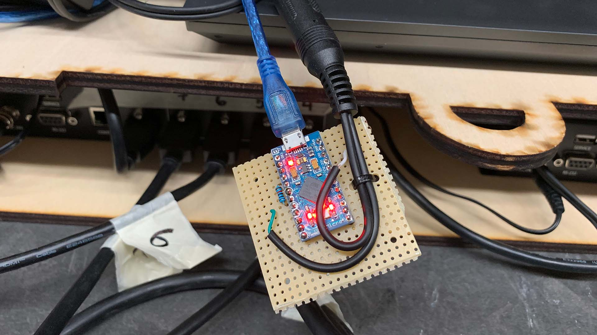
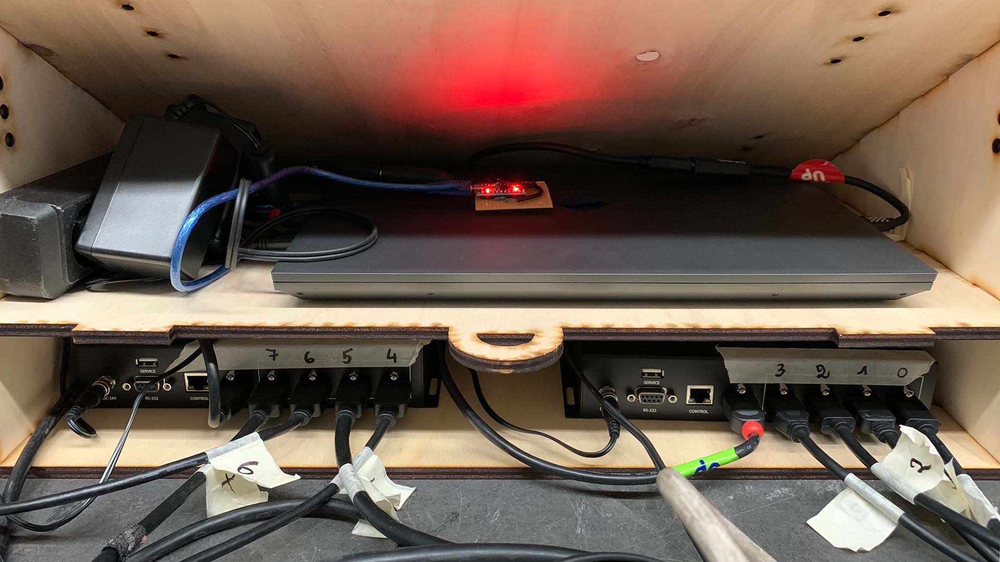
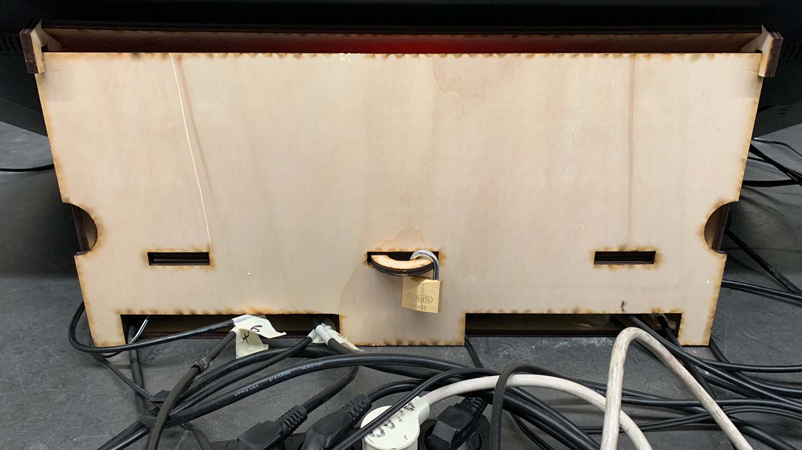
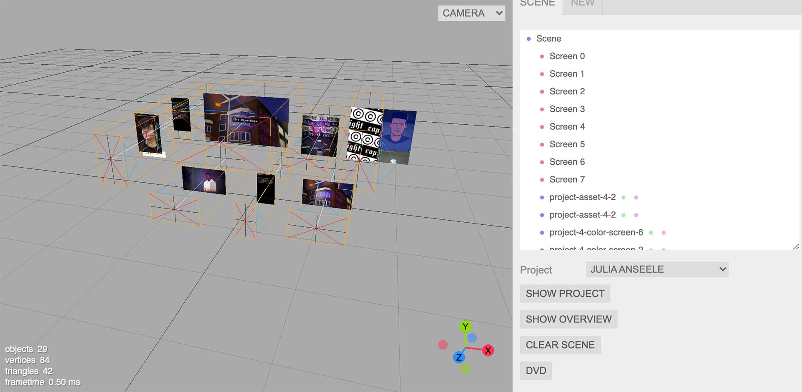
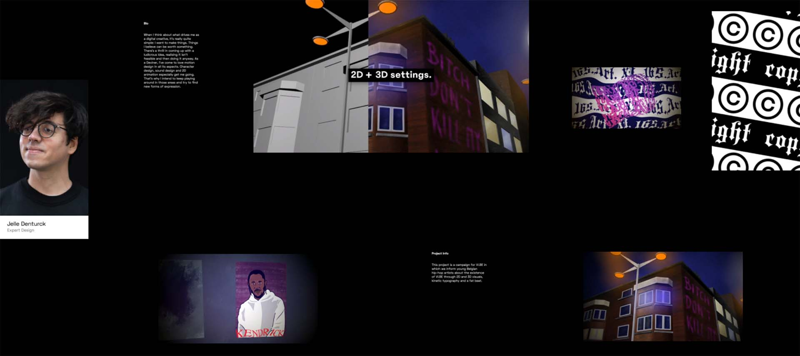
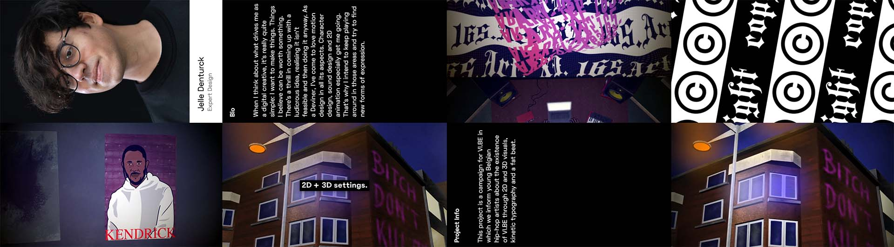

[Following up on my previous post about controlling 8 screens with a single laptop](/2020/12/15/building-a-laptop-driven-8-screen-installation/), I'm happy to say our videowall had it's first run at [the school of arts Ghent Graduation Show](https://graduation.schoolofartsgent.be/2021/home/).

The software is a custom [threejs](https://threejs.org) + [electron](https://www.electronjs.org) application, rendering the content for each screen using the GPU. As for the hardware, we've got a laptop with 2 4K outputs, each one connected to an HDMI splitter. For a COVID-proof control of the installation, I used a foot-pedal, connected to an Arduino Pro Micro, which translates the button press into a keyboard press. Using keyboard commands instead of serial communication or firmata made integration into the application a lot easier.

My colleague and autodesk fusion wizard [Simon Vanherweghe](https://twitter.com/donebysimon) designed & built a cabinet, on which the largest display rest, and contains the laptop and HDMI splitters:

The Electron application has two parts: an editor to setup the screen positions and sizes + an output program spanning two 4K displays, rendering the output into an 8x2 grid.

In the screenshot above, you see an example setup for a project. The (desired) physical output would look something like this:

The HDMI splitters each take one 4K image, and split them over 4 screens. In our case, these screens are not physically setup in a grid, but are further apart / oriented differently. By using 8 ThreeJS perspective cameras, and rendering those camera outputs into an 8x2 grid structure, we get this desired output:

The application itself displayed the works of 25 graduates, content input happened with a basic Strapi CMS setup on Heroku + Amazon S3. To make sure we weren't reliant on an internet connection, all content was synchronized locally. The installation ran uninterrupted for 6 days, at a nice and smooth 60fps.

Check out a small preview of the running setup:

<iframe width="560" height="315" src="https://www.youtube.com/embed/-KXYGIn6faQ" title="YouTube video player" frameborder="0" allow="accelerometer; autoplay; clipboard-write; encrypted-media; gyroscope; picture-in-picture" allowfullscreen></iframe>