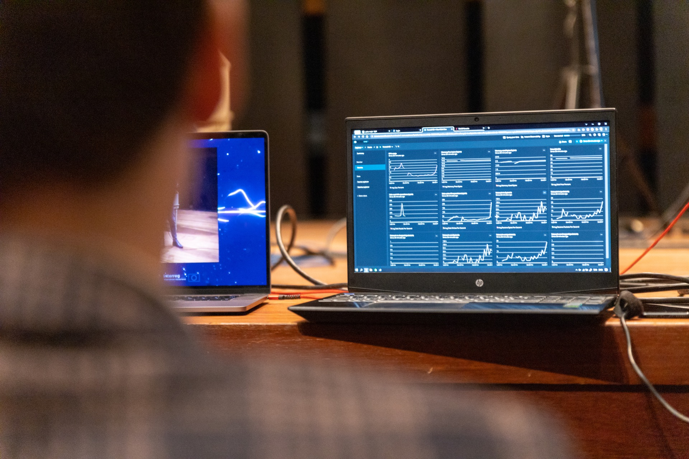

A couple of months ago, we at Devine got approached by [Frascati Symphonic Orchestra](https://www.frascatisymphonic.com) to find a solution to engage with a virtual audience. Live classical music concerts have been severely impacted by the COVID-19 pandemic. With restrictions on gatherings, concerts have been moved online, allowing audiences to watch and listen from the comfort of their homes. This shift has created new challenges, one of which is how to connect with the audience, who is no longer physically present in the room. To address this challenge, I built a platform that tracks audience emotions during a classical music concert and displays them in real-time to both the artists playing and the audience.

<iframe width="560" height="315" src="https://www.youtube.com/embed/MVUDv5Een4c" title="YouTube video player" frameborder="0" allow="accelerometer; autoplay; clipboard-write; encrypted-media; gyroscope; picture-in-picture" allowfullscreen></iframe>

The platform uses facial recognition technology - [face-api.js](https://justadudewhohacks.github.io/face-api.js/docs/index.html) - to detect the emotions of the audience members who are watching the concert from home. It identifies six basic emotions: happiness, sadness, surprise, anger, fear, and neutral.

[React-Three-Fiber](https://github.com/pmndrs/react-three-fiber) is used to create a dynamic and interactive visual representation of the emotional response. Each emotion is displayed with a distinct color, and the amplitude of the emotion wave lines represents the number of people feeling that emotion. This allows both the artists and the audience to see the emotional response to the music in real-time, providing a unique and interactive experience.

The use of MQTT ensured real-time synchronization between the audience's emotional response and the display on the platform, providing a seamless and uninterrupted experience.

## Team
- Lead: [Jelle Demanet](https://www.linkedin.com/in/jelle-demanet-51a5223a/)
- Frontend: [Wouter Verweirder](https://www.linkedin.com/in/aboutwouter/)
- Python MQTT Backend: [Jens Krijgsman](https://www.linkedin.com/in/jens-krijgsman/)