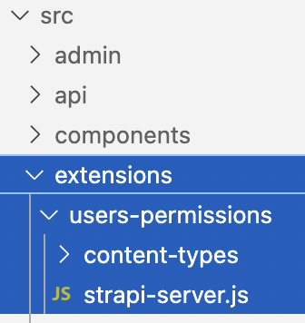

One of the go-to headless cms systems I often use is [Strapi CMS](http://strapi.io). For a recent project, I needed to store some extra information linked to a user. Inside of the CMS, you can define extra fields linked to a user, however you can't really manage those using the API.

One of the features that was needed, was uploading an avatar during user registration. In order to implement this, I had to create an "extension" for the users-permissions plugin.

You can do so by creating a file named src/extensions/users-permissions/strapi-server.js:



Inside of this strapi-server file, you can then overwrite the default register action

```javascript
module.exports = (plugin) => {
  const origAuthRegister = plugin.controllers.auth.register;

  plugin.controllers.auth.register = async (ctx) => {
    await origAuthRegister(ctx);
  }

  return plugin;
}
```

Inside of that register method, you can then use the upload service to handle the uploaded file and link it to the user that was created:

```javascript

const parseFiles = (files) => {
  const parsed = Object.keys(files).reduce((acc, key) => {
    const fullPath = _.toPath(key);

    if (fullPath.length <= 1 || fullPath[0] !== 'files') {
      return acc;
    }

    const path = _.tail(fullPath);
    acc[path.join('.')] = files[key];
    return acc;
  }, {});
  return parsed;
};

plugin.controllers.auth.register = async (ctx) => {
  await origAuthRegister(ctx);
  const response = ctx.response.body;
  if (response.user) {
    if (ctx.is('multipart')) {
      const files = parseFiles(ctx.request.files);
      if (files.avatar) {
        const uploadService = strapi.plugin('upload').service('upload');
        await uploadService.uploadToEntity({ id: response.user.id, model: 'plugin::users-permissions.user', field: 'avatar' }, files.avatar);
      }
    }
  }
};
```